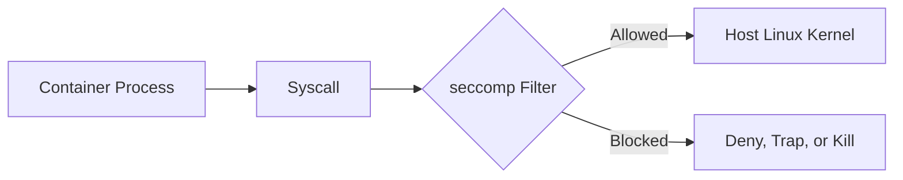

# 07 seccomp capabilities

`seccomp capabilities` demonstrates Linux process governance at the syscall boundary. This lab explores **Secure Computing Mode (`seccomp`)** for syscall filtering and **Linux Capabilities** for understanding which privileged kernel operations a process is allowed to perform.

## What It Demonstrates

- **Syscall Whitelisting**: Installing a tiny `seccomp` BPF program that allows only a narrow set of system calls.
- **Kernel-Enforced Failure**: Proving that a forbidden syscall is stopped by the kernel, not by application-level checks.
- **Least Privilege**: Reading capability masks from `/proc/self/status` to inspect the process's effective authority.
- **Sandbox Bootstrapping**: Using `PR_SET_NO_NEW_PRIVS` before enabling `seccomp`, matching the safety contract used by container runtimes and browsers.

## Manual Usage

Run from the repository root:

1. **Inspect the current process capabilities:**
   ```bash
   go run labs/07-seccomp-capabilities/main.go caps
   ```

2. **Run the allowed sandbox path:**
   ```bash
   go run labs/07-seccomp-capabilities/main.go sandbox allowed
   ```

3. **Trigger a blocked syscall:**
   ```bash
   go run labs/07-seccomp-capabilities/main.go sandbox breach
   ```

   The `breach` mode attempts `getpid(2)`, which is intentionally not in the whitelist. The kernel should terminate the process with `SIGSYS` or report a bad system call.

## 📖 Reference: Process Governance

### 1. Capabilities (What you are allowed to do)

Linux breaks root-level authority into smaller capability bits. Instead of treating UID 0 as one unlimited privilege, the kernel checks for specific powers at sensitive boundaries.

- **`CapInh`**: Capabilities that can be inherited across `execve`.
- **`CapPrm`**: Capabilities the process may make effective.
- **`CapEff`**: Capabilities currently active for permission checks.
- **`CapBnd`**: The bounding set that limits what the process can ever acquire.
- **`CapAmb`**: Ambient capabilities preserved across some `execve` calls.

### 2. `no_new_privs` (No privilege escalation)

Before an unprivileged process can install a `seccomp` filter, it must set `PR_SET_NO_NEW_PRIVS`. This tells the kernel that future `execve` calls cannot grant additional privilege through setuid binaries or file capabilities.

### 3. `seccomp` (What syscalls you can make)

`seccomp` filters run inside the kernel before a syscall is executed. The filter receives syscall metadata, including the syscall number and architecture, then returns an action.

In a container or pod, the process still uses the host Linux kernel. `seccomp` sits at that syscall boundary:



If the syscall is allowed, the kernel handles it normally. If it is blocked, the kernel denies it, traps it, or terminates the process depending on the filter action.

- **Common allowed syscalls**: `read(2)`, `write(2)`, `openat(2)`, `close(2)`, `mmap(2)`, `futex(2)`, `exit(2)`.
- **Common blocked syscalls**: `mount(2)`, `ptrace(2)`, `bpf(2)`, `keyctl(2)`, `reboot(2)`, `clone(2)`, `unshare(2)`, `setns(2)`.
- **`SECCOMP_RET_ALLOW`**: Permit the syscall.
- **`SECCOMP_RET_KILL_PROCESS`**: Immediately terminate the process.
- **`SECCOMP_RET_ERRNO`**: Deny the syscall and return an error code.
- **`SECCOMP_RET_TRAP`**: Deliver `SIGSYS` to the process.

### 4. The Sandbox Contract

The secure path is:

1. Set `PR_SET_NO_NEW_PRIVS`.
2. Install a whitelist filter with `PR_SET_SECCOMP`.
3. Run only the small operation that needs to be sandboxed.
4. Let the kernel terminate the process if it escapes the allowed syscall set.

[Back to main README](../../README.md)
