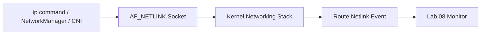

# 08 netlink route monitoring

`netlink route monitoring` demonstrates how Linux networking tools talk directly to the kernel's routing engine. This lab uses **`AF_NETLINK` sockets** with the **`NETLINK_ROUTE`** protocol to receive real-time events when links, IP addresses, or routes change.

## What It Demonstrates

- **Kernel Networking Events**: Subscribing to `RTMGRP_*` multicast groups instead of polling `/proc` or shelling out to `ip`.
- **Binary Message Parsing**: Decoding `nlmsghdr`, `ifinfomsg`, `ifaddrmsg`, `rtmsg`, and route attributes from raw kernel messages.
- **Network Stack Visibility**: Observing `RTM_NEWLINK`, `RTM_DELLINK`, `RTM_NEWADDR`, `RTM_DELADDR`, `RTM_NEWROUTE`, and `RTM_DELROUTE` events.
- **Systems Tooling Foundations**: Recreating the low-level event stream used by `iproute2`, `NetworkManager`, and Kubernetes CNI components.

## Manual Usage

Run from the repository root:

1. **Start the route monitor:**
   ```bash
   go run labs/08-netlink-route-monitoring/main.go monitor
   ```

2. **Observe normal host events:**

   On immutable or tightly managed systems such as Fedora Silverblue, network mutation commands may be blocked even with `sudo`. Leave the monitor running and trigger events through normal desktop or host actions:

   - Connect or disconnect Wi-Fi.
   - Connect or disconnect a VPN.
   - Plug or unplug Ethernet.
   - Toggle airplane mode from the desktop UI.
   - Start or stop a local container if your environment creates network interfaces.

## 📖 Reference: The Netlink Control Plane

### 1. `AF_NETLINK` (Kernel to user-space IPC)

Netlink is a socket family designed for structured communication between user-space processes and the Linux kernel. Unlike `/proc`, which often requires polling text files, netlink can push binary events to subscribers as soon as the kernel state changes.



### 2. `NETLINK_ROUTE` (Networking state)

`NETLINK_ROUTE` is the protocol family for links, addresses, routes, neighbors, traffic control, and routing rules. This lab subscribes to route netlink groups so the kernel sends events without a polling loop.

- **`RTMGRP_LINK`**: Interface creation, deletion, and state changes.
- **`RTMGRP_IPV4_IFADDR` / `RTMGRP_IPV6_IFADDR`**: IP address add/remove events.
- **`RTMGRP_IPV4_ROUTE` / `RTMGRP_IPV6_ROUTE`**: Route table updates.

### 3. Route Message Types

Every netlink message begins with an `nlmsghdr`. The `Type` field tells the receiver what structure follows.

- **`RTM_NEWLINK` / `RTM_DELLINK`**: Network interface state changed.
- **`RTM_NEWADDR` / `RTM_DELADDR`**: Interface address changed.
- **`RTM_NEWROUTE` / `RTM_DELROUTE`**: Route table entry changed.

### 4. Attributes (Typed binary fields)

After the fixed-size message body, netlink messages carry route attributes. Each attribute has a length, a type, and a payload. This is how the kernel attaches fields like interface names and IP addresses.

- **`IFLA_IFNAME`**: Interface name, such as `lo`, `eth0`, or `wlan0`.
- **`IFA_LOCAL` / `IFA_ADDRESS`**: IP address assigned to an interface.
- **`RTA_DST`**: Route destination prefix.

### 5. Useful `ip` Commands

These commands are useful when comparing the lab output with the system's current network state:

```bash
# Show interfaces, state, and assigned IP addresses
ip -br addr

# Show detailed interface and address information
ip addr

# Show the route table
ip route

# Show the default route used for internet-bound traffic
ip route show default

# Watch the same class of network state changes using iproute2
ip monitor link address route
```

Important fields:

- **Interface name**: The connection path, such as Wi-Fi, Ethernet, VPN tunnel, loopback, or container bridge.
- **`UP` / `DOWN`**: Whether the interface is active from the kernel's point of view.
- **`inet`**: The IPv4 address assigned to that interface.
- **`inet6`**: The IPv6 address assigned to that interface.
- **`brd`**: Broadcast address for the subnet, not the machine's assigned IP.
- **Default route**: The route the kernel uses for traffic that does not match a more specific route.

[Back to main README](../../README.md)
