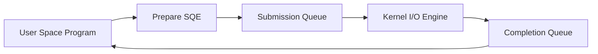

# 09 io uring async io

`io uring async io` demonstrates Linux's modern asynchronous I/O interface. This lab explores the **Submission Queue (SQ)** and **Completion Queue (CQ)** model used by `io_uring` to reduce syscall overhead and move high-volume I/O toward a shared-memory control path.

## What It Demonstrates

- **Shared Ring Buffers**: Mapping kernel-created SQ and CQ rings into user space with `mmap`.
- **Submission Queue Entries**: Preparing an SQE and publishing it to the kernel through the SQ tail pointer.
- **Completion Queue Entries**: Reading CQEs after the kernel finishes work and advances the CQ tail pointer.
- **Fast Path I/O**: Understanding how `io_uring` can batch work so programs do not need one syscall per `read` or `write`.
- **Kernel Feature Detection**: Probing whether the current Linux kernel and security policy allow `io_uring_setup`.

## Manual Usage

Run from the repository root:

1. **Probe `io_uring` availability:**
   ```bash
   go run labs/09-io-uring-async-io/main.go probe
   ```

2. **Submit a no-op request through the ring:**
   ```bash
   go run labs/09-io-uring-async-io/main.go nop
   ```

3. **Write data through `io_uring`:**
   ```bash
   go run labs/09-io-uring-async-io/main.go write "hello from the ring"
   ```

4. **Read the scratch file through `io_uring`:**
   ```bash
   go run labs/09-io-uring-async-io/main.go read
   ```

   The write/read commands use `labs/09-io-uring-async-io/scratch/io-uring-lab.txt` so the visible file action stays inside the lab directory.

   If this fails with `operation not permitted`, the kernel, container runtime, or security policy may be blocking `io_uring`. That is common in restricted containers and hardened environments.

## 📖 Reference: The `io_uring` Fast Path

### 1. The Old Path

Traditional blocking I/O often looks like this:

```text
read syscall -> kernel does work -> return to user space
write syscall -> kernel does work -> return to user space
```

That model is simple, but high-throughput programs pay for repeated syscall crossings and context switches.

Compared with Lab 08:

- **Lab 08 (`netlink`)**: The kernel reports that network state changed, and the program observes the event.
- **Lab 09 (`io_uring`)**: The program asks the kernel to perform I/O work asynchronously, and the kernel reports completion later.

### 2. The Ring Model

`io_uring` creates shared queues between user space and the kernel:



The application writes work requests into the SQ. The kernel consumes those requests and writes results into the CQ.

### 3. SQ and CQ

- **SQE (Submission Queue Entry)**: A request, such as `READV`, `WRITEV`, `FSYNC`, or `NOP`.
- **SQ tail**: Advanced by user space after publishing new work.
- **SQ head**: Advanced by the kernel after consuming work.
- **CQE (Completion Queue Entry)**: A result containing `user_data`, `res`, and flags.
- **CQ tail**: Advanced by the kernel after completing work.
- **CQ head**: Advanced by user space after consuming completions.

### 4. Fixed Resources

`io_uring` can reduce lookup overhead by registering buffers and files ahead of time. With fixed buffers, the kernel can operate on known memory regions instead of repeatedly importing user buffers for every operation.

This lab starts with `IORING_OP_NOP` because it isolates the queue mechanics, then uses `IORING_OP_WRITEV` and `IORING_OP_READV` to make the file action visible in the lab scratch directory.

### 5. Useful Commands

```bash
# Show kernel version
uname -r

# Check whether the kernel exposes io_uring sysctls
ls /proc/sys/kernel | grep io_uring

# Run the lab probe
go run labs/09-io-uring-async-io/main.go probe

# Write and read the lab scratch file through io_uring
go run labs/09-io-uring-async-io/main.go write "hello from the ring"
go run labs/09-io-uring-async-io/main.go read
```

[Back to main README](../../README.md)
