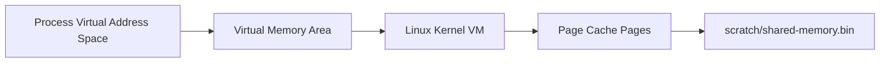
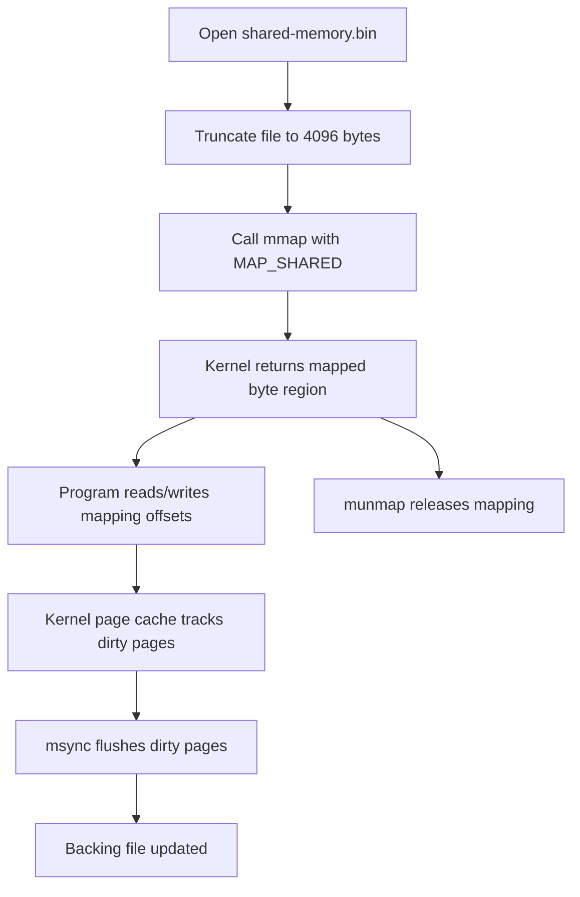

# 10 shared memory mmap

`shared memory mmap` demonstrates how the Linux kernel maps file-backed pages into a process virtual address space. This lab uses **`mmap` with `MAP_SHARED`** so the mapped file appears in `/proc/self/maps` and can also be shared between independent processes.

## What It Demonstrates

- **Virtual Memory Mappings**: Creating a file-backed region in the process address space with `mmap`.
- **Kernel Mapping Visibility**: Inspecting the mapped region through `/proc/self/maps`.
- **Shared File-Backed Pages**: Using `MAP_SHARED` so independent processes can see updates through the same mapped file.
- **Structured Memory Layout**: Encoding a small header and payload into fixed offsets inside the mapped page.
- **Explicit Flushes**: Calling `msync` so dirty mapped pages are written back to the backing file.

## Manual Usage

Run from the repository root:

1. **Initialize the shared memory file:**
   ```bash
   go run labs/10-shared-memory-mmap/main.go init
   ```

2. **Inspect the kernel mapping for the current process:**
   ```bash
   go run labs/10-shared-memory-mmap/main.go inspect
   ```

3. **Watch the shared memory region in one terminal:**
   ```bash
   go run labs/10-shared-memory-mmap/main.go watch
   ```

4. **Write a message from another terminal:**
   ```bash
   go run labs/10-shared-memory-mmap/main.go write "hello through mmap"
   ```

5. **Read the current message once:**
   ```bash
   go run labs/10-shared-memory-mmap/main.go read
   ```

   The commands use `labs/10-shared-memory-mmap/scratch/shared-memory.bin` so the mapped file stays inside the lab directory.

## 📖 Reference: Shared Memory with `mmap`

### 1. The Kernel Idea

Each Linux process has its own virtual address space. `mmap` asks the kernel to add a new virtual memory area to that process.

For this lab, that virtual memory area is backed by a normal file:



After the mapping exists, the program can access the mapped bytes like normal memory. The kernel connects those memory accesses to file-backed pages.

### 2. Flow: How the Program Uses `mmap`

The program does not process `mmap` as a special file format. It asks the kernel for a mapping, then works with the returned memory region.



In Go, the mapped region is returned as a `[]byte`:

```go
mapping, err := syscall.Mmap(
    int(file.Fd()),
    0,
    mappingSize,
    syscall.PROT_READ|syscall.PROT_WRITE,
    syscall.MAP_SHARED,
)
```

After that, normal byte-slice operations read and write the mapped file-backed pages:

```go
copy(mapping[payloadOffset:], payload)
payload := string(mapping[payloadOffset : payloadOffset+length])
```

### 3. `MAP_SHARED`

`MAP_SHARED` tells the kernel that writes to the mapping belong to the shared backing file. Other processes that map the same file can see those bytes too.

- **`MAP_SHARED`**: Updates are shared with other mappings of the same file.
- **`MAP_PRIVATE`**: Updates are copy-on-write and private to the process.
- **`PROT_READ`**: The process may read from the mapping.
- **`PROT_WRITE`**: The process may write to the mapping.

### 4. Where Linux Shows It

Linux exposes a process's memory mappings through `/proc/<pid>/maps`. The `inspect` command maps the lab file, prints the virtual address range, and then prints the matching `/proc/self/maps` line.

A mapping line shows:

```text
address-range permissions offset device inode path
```

For this lab, the path should point at:

```text
labs/10-shared-memory-mmap/scratch/shared-memory.bin
```

### 5. Why It Can Become IPC

Once two processes map the same file with `MAP_SHARED`, they can communicate through those shared bytes. That IPC behavior is a use case of `mmap`; it is not automatic message passing from the kernel.

The sequence number in this lab is just a small user-space protocol so `watch` can tell that a new write happened.

### 6. Lab Memory Layout

This lab keeps the layout intentionally small and inspectable:

```text
0      magic bytes
8      version
16     sequence number
24     unix timestamp in nanoseconds
32     payload length
64     payload bytes
```

The sequence number changes every time `write` stores a new message. The `watch` command polls that sequence number and prints the message when it changes. That sequence check is lab logic, not built-in `mmap` behavior.

### 7. Useful Commands

```bash
# Inspect the mapping created by the lab
go run labs/10-shared-memory-mmap/main.go inspect

# Show the mapped file
ls -lh labs/10-shared-memory-mmap/scratch/shared-memory.bin

# Inspect the raw bytes
xxd labs/10-shared-memory-mmap/scratch/shared-memory.bin | head

# See mappings for a running watcher process
pgrep -f "10-shared-memory-mmap/main.go watch"
cat /proc/<pid>/maps | grep shared-memory.bin
```

[Back to main README](../../README.md)
