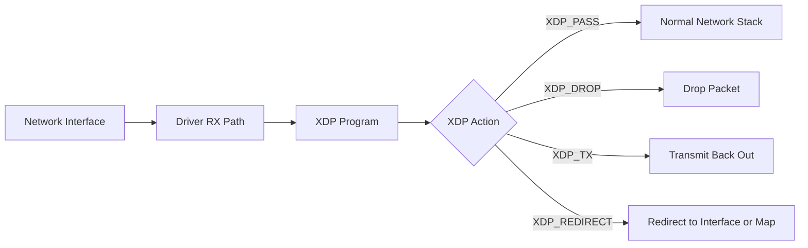
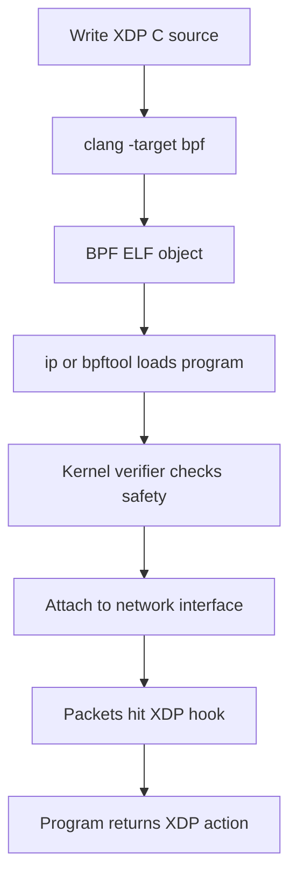

# 11 ebpf xdp

`ebpf xdp` demonstrates how Linux can run verified packet-processing code inside the kernel at the network driver ingress path. This lab includes a minimal XDP program that returns `XDP_PASS` and a Go helper for probing host support, inspecting interfaces, and printing the privileged load/unload commands.

## What It Demonstrates

- **Programmable Kernel Hooks**: Attaching an XDP program to a network interface ingress path.
- **eBPF Verification**: Understanding that the kernel verifies BPF bytecode before it can run.
- **XDP Actions**: Returning `XDP_PASS` so packets continue into the normal networking stack.
- **Host Capability Checks**: Probing for kernel BPF settings, bpffs, `clang`, `bpftool`, and available interfaces.
- **Safe Workflow Separation**: Keeping normal `go test` coverage unprivileged while documenting the privileged host steps.

## Manual Usage

Run from the repository root:

1. **Probe host eBPF/XDP readiness:**
   ```bash
   go run labs/11-ebpf-xdp/main.go probe
   ```

2. **List network interfaces visible to this Linux namespace:**
   ```bash
   go run labs/11-ebpf-xdp/main.go interfaces
   ```

3. **Show status for one interface:**
   ```bash
   go run labs/11-ebpf-xdp/main.go status lo
   ```

4. **Print compile, attach, inspect, and detach commands:**
   ```bash
   go run labs/11-ebpf-xdp/main.go commands lo
   ```

   The C file is not run directly. It is compiled into a BPF object file, then the object file is loaded into the kernel and attached to a network interface.

5. **Compile the XDP C source into a BPF object file:**
   ```bash
   mkdir -p labs/11-ebpf-xdp/build
   clang -O2 -target bpf -c labs/11-ebpf-xdp/bpf/xdp_pass.c -o labs/11-ebpf-xdp/build/xdp_pass.o
   ```

6. **Inspect the object sections:**
   ```bash
   llvm-objdump -h labs/11-ebpf-xdp/build/xdp_pass.o
   ```

   For this lab, the important sections are `xdp` and `license`. If you still see sections such as `.BTF`, `.rodata`, `.data`, or `globals`, rebuild the object with the compile command above.

7. **Load the BPF object into the kernel and pin it in bpffs:**
   ```bash
   sudo bpftool prog load labs/11-ebpf-xdp/build/xdp_pass.o /sys/fs/bpf/xdp_pass_lab type xdp
   ```

8. **Attach the pinned program to an interface using generic XDP:**
   ```bash
   sudo bpftool net attach xdpgeneric pinned /sys/fs/bpf/xdp_pass_lab dev lo overwrite
   ```

9. **Inspect the attachment:**
   ```bash
   sudo bpftool net show dev lo
   ```

10. **Detach the XDP program from the interface:**
   ```bash
   sudo bpftool net detach xdpgeneric dev lo
   ```

   Use a non-production interface when you attach XDP. Attaching packet programs to Wi-Fi, VPN, Ethernet, bridge, or Kubernetes interfaces can affect live traffic. This lab uses `xdpgeneric` because it is the safer fallback path for loopback, toolbox, and development environments.

## 📖 Reference: eBPF and XDP

### 1. The Kernel Idea

eBPF lets Linux load small verified programs into kernel hook points. XDP is one of those hook points. It runs very early for received packets, before the normal networking stack handles them.



The important system point is that the program runs in the kernel path, but only after the verifier accepts it.

### 2. Flow: How an XDP Program Gets Used



The Go helper in this lab does not attach the program by itself. It prints the host commands so the privileged action is explicit.

### 3. XDP Actions

An XDP program returns an action code that tells the kernel what to do with the packet.

- **`XDP_PASS`**: Continue into the normal network stack.
- **`XDP_DROP`**: Drop the packet immediately.
- **`XDP_TX`**: Transmit the packet back out the same interface.
- **`XDP_REDIRECT`**: Redirect the packet to another interface, CPU, socket, or map target.
- **`XDP_ABORTED`**: Abort because the program hit an unexpected path.

This lab's C program returns `XDP_PASS`, so it should not intentionally change traffic behavior.

### 4. Minimal Program

The included source is `labs/11-ebpf-xdp/bpf/xdp_pass.c`:

```c
SEC("xdp")
int xdp_pass(struct xdp_md *ctx) {
    return XDP_PASS;
}
```

It is intentionally small so the main concept is the load path: source code, BPF bytecode, verifier, interface attachment, and packet hook.

You do not run this C file like a normal program. The compile step uses `clang -target bpf` to produce `xdp_pass.o`, and the attach step asks Linux to load that object into the XDP hook for an interface.

The compile command intentionally omits `-g`. Some toolbox/iproute2/libbpf combinations can fail while handling debug/BTF global metadata with errors such as `mkdir (null)/globals failed`. The lab keeps the object minimal and uses `bpftool` to split loading from attachment so the failing step is visible.

### 5. Useful Commands

```bash
# Probe the host
go run labs/11-ebpf-xdp/main.go probe

# Print the attach workflow for an interface
go run labs/11-ebpf-xdp/main.go commands lo

# Compile manually
mkdir -p labs/11-ebpf-xdp/build
clang -O2 -target bpf -c labs/11-ebpf-xdp/bpf/xdp_pass.c -o labs/11-ebpf-xdp/build/xdp_pass.o

# Inspect the object
llvm-objdump -h labs/11-ebpf-xdp/build/xdp_pass.o

# Load and pin the program
sudo bpftool prog load labs/11-ebpf-xdp/build/xdp_pass.o /sys/fs/bpf/xdp_pass_lab type xdp

# Attach the pinned program
sudo bpftool net attach xdpgeneric pinned /sys/fs/bpf/xdp_pass_lab dev lo overwrite

# Inspect the attachment
sudo bpftool net show dev lo

# Detach manually
sudo bpftool net detach xdpgeneric dev lo
```

[Back to main README](../../README.md)
